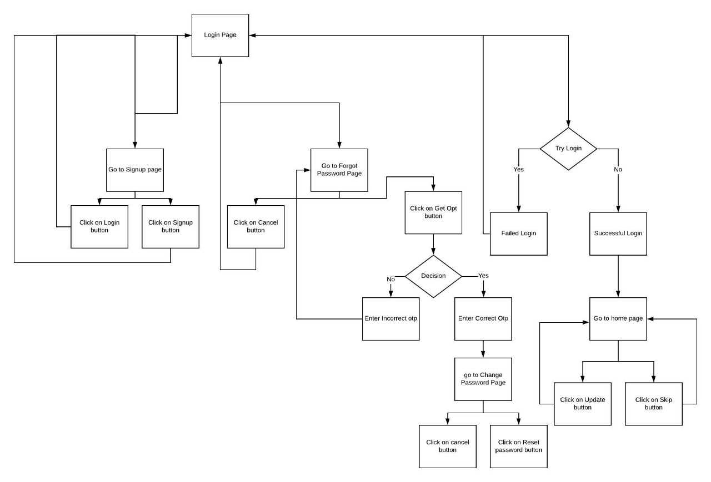

# ShelterApp Volunteer Portal

## How to run

- SSH into server using server credentials( present in server-cred.json)

- Add inbound port rules for port 80 to accept all connection types

- Same for outbound port rules

- Restart server

- First install python3 using

```
sudo apt-get install python3.6
```

- Second install pip3

```
sudo apt-get install python3-pip
```

- Third install requirements for the system

```
pip3 install -r requirements.txt
```

- You can change db and password in config.json
 
- Run server by command

```
sudo python3 controller.py
```

## Features

* Gets url from mongoDB for each service(6800 in total), scrape data, show in UI, wait for approval, make a PUT request, get data for next service
* The UI shows the mismatch of the current data and the scraped data
* The UI allows the volunteer to update the data.
* login/signup page is added to the webapp
* After completion updates the atlas db
* Two columns named isCrawled(bit) and crawledAt(date) is added to each record(if not present), only those records will be scraped for whose (currentDate-crawledAt) is greater than some threshold

## App flow
- > 
    
## Files and Folders
- >     App

- > Requirements.txt
    1. It contains all the requirements for the System
- > Controllers.py
    1. This is the file which contain all apis.
    2. On getting requests via api it interact with model and return results. 
    3. This file is also used in sending verification email.
- > models.py
    1. This is the file which handle all databases.
    1. This perform all the transactions with atlas.
    1. This file also scrap data from websites, google and facebook.
- >     templates folder
    1. changepassword.html:-It contains html page for '/changepassword'
    2. forgotpassword.html:-It contains html page for '/forgotpassword'
    3. home.html:-It contains html page for '/'
    4. Login.html:-It contains html page for '/Login'
    5. SignUp.html:-It contains html page for '/SignUp'
- >     static folder
    1. css Folder
        - > home.css:-It contains css for html page for '/'
    2. img Folder
        - > logo2.jpg:-It contains logo for '/Login'
    3. js folder
        - > home.js:-It contains javascript code for html page for '/'
